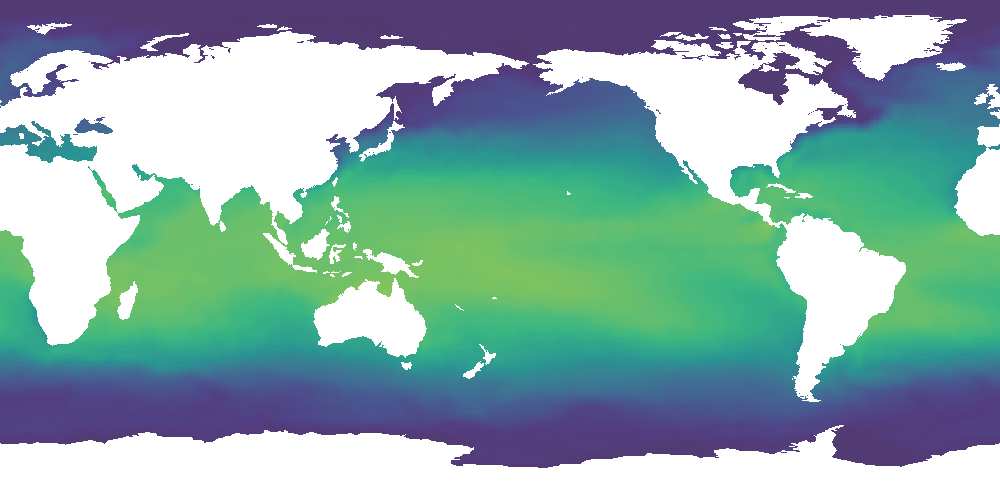
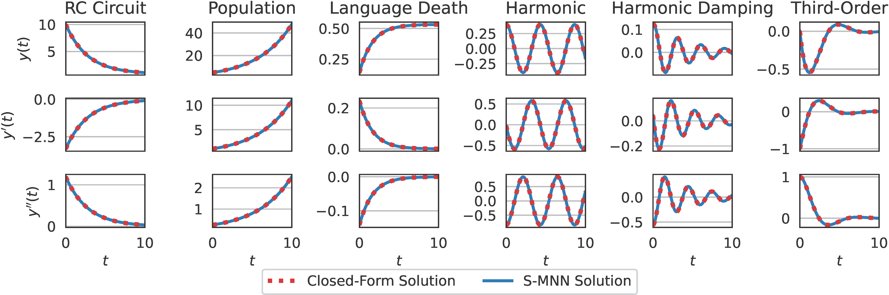
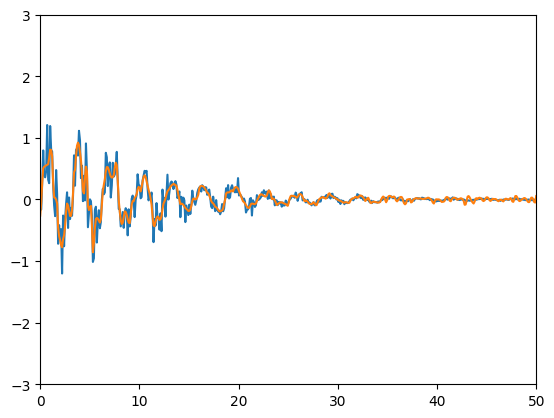
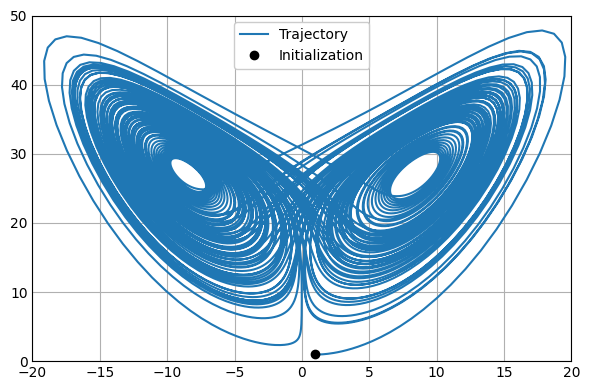
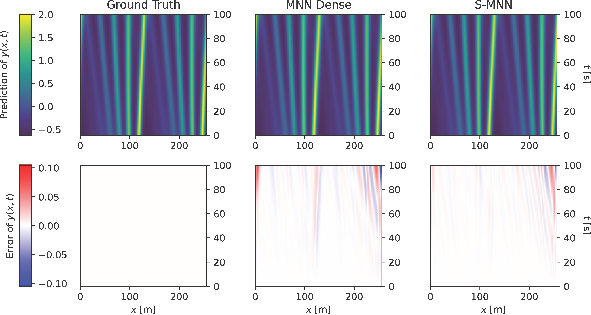
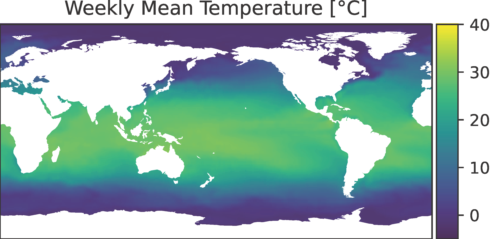

# Scalable Mechanistic Neural Networks (ICLR 2025)

[ICLR.cc](https://iclr.cc/virtual/2025/poster/29818) |
[OpenReview.net](https://openreview.net/forum?id=Oazgf8A24z) |
[arXiv.org](https://arxiv.org/abs/2410.06074) |
[GitHub.com](https://github.com/IST-DASLab/ScalableMNN) |
[Citation](#citation)

<p align="center">

</p>

Official repository for the ICLR 2025 paper "Scalable Mechanistic Neural Networks" by _Jiale Chen_, _Dingling Yao_, _Adeel Pervez_, _Dan Alistarh_, and _Francesco Locatello_ from the _Institute of Science and Technology Austria (ISTA)_.

**Keywords:** Scientific Machine Learning, Ordinary Differential Equations, Time Series, Dynamical Systems

## Paper Abstract

**TL;DR:** We introduce a scalable solver for the mechanistic neural networks that reduces time and memory costs from cubic/quadratic to linear in the sequence length, enabling long-horizon scientific modeling of dynamical systems in the neural networks.

> We propose Scalable Mechanistic Neural Network (S-MNN), an enhanced neural network framework designed for scientific machine learning applications involving long temporal sequences. By reformulating the original Mechanistic Neural Network (MNN) (Pervez et al., 2024), we reduce the computational time and space complexities from cubic and quadratic with respect to the sequence length, respectively, to linear. This significant improvement enables efficient modeling of long-term dynamics without sacrificing accuracy or interpretability. Extensive experiments demonstrate that S-MNN matches the original MNN in precision while substantially reducing computational resources. Consequently, S-MNN can drop-in replace the original MNN in applications, providing a practical and efficient tool for integrating mechanistic bottlenecks into neural network models of complex dynamical systems. Source code is available at https:<!---->//github.com/IST-DASLab/ScalableMNN.

Please read our full paper if you are interested in the method details.

## Usage
<p>
<a href="https://www.python.org/downloads/"></a>
<a href="https://pytorch.org/get-started/"></a>
</p>

**The [smnn.py](./smnn.py) file is all you need!**
Our solver is implemented in a fully portable way such that everything is in just one file.
With `Ctrl-C` and `Ctrl-V`, you can easily apply it to your project without even cloning this repository.
No more harassment of setting folders and paths.  

**PyTorch is the only dependency!**
No other third-party libraries are required.
Say goodbye to environment conflicts.

**Just call the `ode_forward` function!**
We designed the interface as functional as possible so that you do not need to create a "solver object" before the actual computation.
Write `from smnn import ode_forward` and you are ready to go.

**Additional Notes:**

- You can find the specifications of the input and output values in the comments under the function signatures.

- You may look at the Jupyter Notebooks in the [examples](./examples/) folder to find some exemplary use cases. More details are in the [example experiments section](#running-example-experiments).

- To help you better understand our method and facilitate future development, we also provide `ode_forward_reference` and `ode_forward_basic` functions in the [smnn.py](./smnn.py) file.
  `ode_forward_reference` is the most straight-forward implementation with cubic time complexity and quadratic space complexity.
  `ode_forward_basic` is the simplest implementation with linear time complexity and space complexity.
  Remember, `ode_forward` is the fastest implementation (with all the fancy optimization tricks) that you should use.

### [Optional] Installing the Auxiliary Package

Due to the inherent data dependencies in certain components, the CPU execution can sometimes become a bottleneck. We have by default used CUDA Graph to mitigate this issue.

However, if CUDA Graph is not applicable to your use cases, e.g., CPU-only, you can optionally install our auxiliary [package](./package/) for our S-MNN solver. We have used the PyTorch C++ API to rewrite those slow components to help you reduce the Python overheads.

To install this package, simply clone this repository and run:

```bash
cd package && ./install.sh
```

## Running Example Experiments

Additional third-party packages may be required for the experiments. Please install them if you encounter an `ImportError` when running the Jupyter Notebooks.

### Standalone Validation

[Link](./examples/standalone/standalone.ipynb) to the Jupyter Notebook.

<p align="center">

</p>

To assess the correctness of our solver in solving linear ordinary differential equations (ODEs), we conduct a standalone validation. Our solver is designed to solve linear ODEs directly without incorporating additional neural network layers or trainable parameters.

The source codes are adapted from: [ODEFormer: Symbolic Regression of Dynamical Systems with Transformers](https://github.com/sdascoli/odeformer), MIT license.

### Fitting Noisy Sine Waves

[Link](./examples/sine/sine.ipynb) to the Jupyter Notebook.

<p align="center">

</p>

Fitting an exponentially damped noisy sine wave with a second-order ODE.

The source codes are adapted from: [Mechanistic Neural Networks for Scientific Machine Learning](https://github.com/alpz/mech-nn).

### Comparative Analysis: Discovery of Governing Equations

[Link](./examples/lorenz/lorenz.ipynb) to the Jupyter Notebook. (The notebook is for illustrative proposes only. Finetuning is required to get the metrics reported in the paper.)

<p align="center">

</p>

In this experiment, we evaluate the capability of our S-MNN in discovering the coefficients of the governing equations for the Lorenz system following Section 5.1 in the origin MNN paper. The Lorenz system is a set of nonlinear ODEs known for its chaotic behavior, making it a standard benchmark for testing equation discovery methods in dynamical systems. The governing equations are given by
$$
\begin{cases}
\mathrm{d} x / \mathrm{d} t = \sigma \left( y - x \right) = a_1 x + a_2 y \\
\mathrm{d} y / \mathrm{d} t = x \left( \rho - z \right) - y = a_3 x + a_4 y + a_5 xz \\
\mathrm{d} z / \mathrm{d} t = x y - \beta z = a_6 z + a_7 xy
\end{cases}
$$
where $a_1, \dots, a_7 \in \mathbb{R}$ are the coefficients to be discovered.

The source codes are adapted from: [Mechanistic Neural Networks for Scientific Machine Learning](https://github.com/alpz/mech-nn).

### Comparative Analysis: Solving Partial Differential Equations (PDEs)

[Link](./examples/kdv/kdv.ipynb) to the Jupyter Notebook. (The notebook is for illustrative proposes only. Longer training is required to get the metrics reported in the paper.)

<p align="center">

</p>

we evaluate the capability of our S-MNN in solving partial differential equations (PDE), specifically focusing on the Korteweg-De Vries (KdV) equation, which is a third-order nonlinear PDE that describes the propagation of waves in shallow water and is expressed as
$$
\frac{\partial y}{\partial t} + \frac{\partial^3 y}{\partial x^3}  - 6 y \frac{\partial y}{\partial x} = 0
$$
where $y \left( x, t \right)$ represents the wave amplitude as a function of spatial coordinate $x$ and time $t$. Solving the KdV equation is challenging due to its nonlinearity and the involvement of higher-order spatial derivatives, making it a popular benchmark for PDEs.

The source codes are adapted from: [Mechanistic Neural Networks for Scientific Machine Learning](https://github.com/alpz/mech-nn).

**KdV Dataset Preparation:**

The KdV dataset is not provided in this repository due to its size. If you plan to run the experiment by yourself, please generate the dataset beforehand.

Generate 1D KdV *easier* dataset using the scripts in [LPSDA](https://github.com/brandstetter-johannes/LPSDA). Use the same arguments (e.g., the number of samples) as in their `README.md`.

- [Lie Point Symmetry Data Augmentation for Neural PDE Solvers](https://github.com/brandstetter-johannes/LPSDA) (KdV dataset), MIT license.

After data generation, move the h5 files `KdV_train_512_easy.h5`, `KdV_valid_easy.h5`, and `KdV_test_easy.h5` to the `examples/KDV_easy` folder.

### Real-world Application: Long-term Sea Surface Temperature Forecasting

<p align="center">

</p>

The ability to handle longer sequences and larger batch sizes without sacrificing performance positions our S-MNN as a powerful tool for modeling complex dynamical systems. In this section, we demonstrate a real-world example use case: sea surface temperature (SST) prediction. SST exhibits long periodic features that can only be effectively captured with long sequences.

Please refer to [Marrying Causal Representation Learning with Dynamical Systems for Science](https://github.com/CausalLearningAI/crl-dynamical-systems) (SST), MIT license.

**SST Dataset:**

You may download the SST-V2 dataset using this [link](https://psl.noaa.gov/repository/entry/show/PSL+Climate+Data+Repository/Public/PSL+Datasets/NOAA+OI+SST/Weekly+and+Monthly/sst.wkmean.1990-present.nc?entryid=12159560-ab82-48a1-b3e4-88ace20475cd&output=data.cdl).

## Citation

Please cite our paper if you find it useful. Thank you!

**Plain text:**

```text
Jiale Chen, Dingling Yao, Adeel Pervez, Dan Alistarh, and Francesco Locatello. Scalable mechanistic neural networks. In The Thirteenth International Conference on Learning Representations, 2025. URL https://openreview.net/forum?id=Oazgf8A24z.
```

**BibTex:**

```bibtex
@inproceedings{
chen2025scalable,
title={Scalable Mechanistic Neural Networks},
author={Jiale Chen and Dingling Yao and Adeel Pervez and Dan Alistarh and Francesco Locatello},
booktitle={The Thirteenth International Conference on Learning Representations},
year={2025},
url={https://openreview.net/forum?id=Oazgf8A24z}
}
```
